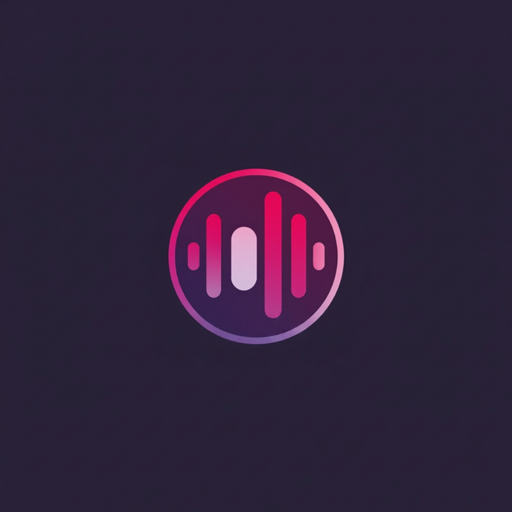

# 🎧 OmniPlayer

<p align="center">
  
</p>

<h3 align="center">A Next-Gen Universal Music Player & Online Streaming App</h3>

<p align="center">
  <b>Built with React Native 0.76+, Expo SDK 57, TypeScript & FFmpeg Native Engine</b>
</p>

<p align="center">
  <a href="https://github.com/khushnoodrehman/omniplayer"></a>
  <a href="https://expo.dev"></a>
  <a href="https://reactnative.dev"></a>
  <a href="https://typescriptlang.org"></a>
  <a href="LICENSE"></a>
</p>

---

## 🌟 Overview

**OmniPlayer** is a high-performance, feature-packed music application designed to bridge offline device audio playback and online streaming into a single, seamless experience. 

Powered by a native C++/Java ID3 tag extraction engine, YouTube Music InnerTube integration, FFmpeg transcoding, and LRCLIB synchronized lyrics, OmniPlayer delivers studio-grade audio streaming, 320kbps downloads, and a floating bubble user interface.

---

## ✨ Key Features

### 🎵 1. Universal Dual-Engine Playback
- **Unified Audio Queue**: Play local MP3/M4A/FLAC/AAC audio files alongside online YouTube Music streams in a single queue.
- **Native Background Audio Service**: Full Android background service integration via `@rntp/player` with lock-screen controls, notification status bar player, and headset event listeners.

### ⚡ 2. Instant Native ID3 Tag Extraction (<10ms)
- Custom native Android module (`MetadataExtractor`) written in C++/Java using `MediaMetadataRetriever`.
- Extracts embedded album art, titles, artists, and album names directly from local binary files in less than 10 milliseconds.

### 📥 3. High-Fidelity Downloader & FFmpeg Transcoder
- **Fast Mode**: Instant stream caching directly to local storage.
- **Premium Mode**:
  - Transcodes audio streams into 320kbps MP3 / AAC using `@wokcito/ffmpeg-kit-react-native`.
  - Enriches metadata via iTunes API and injects Ultra-HD **1000x1000** cover art into audio files.
  - Automatically exports synchronized `.lrc` lyrics sidecar files compliant with Android Scoped Storage (Storage Access Framework).

### 🎤 4. Real-Time Synchronized Lyrics
- Automatically fetches word-for-word synchronized `.lrc` lyrics via LRCLIB and YouTube Music.
- Real-time auto-scrolling lyrics view on the Now Playing screen with smooth line highlighting.

### 🎨 5. Modern Floating Bubble UI & Dynamic Aesthetics
- **Floating Navigation Bar**: Floating bottom navigation bar with rounded corners (`borderRadius: 28`), subtle elevation shadows, and active pill indicators.
- **Animated Equalizer Overlay**: Live `<PlayingBars />` 3-bar animated soundwave overlays on active song cards in Search, Home, Library, and Playlist screens.
- **Custom Theme Palette**: Tailored dark theme (`#121316`) paired with brand logo magenta accents (`#ff2d75`).

### 📁 6. Smart Library & Folder Management
- Automatic device music scanning categorized into **Songs**, **Playlists**, **Albums**, **Artists**, and **Storage Folders**.
- Instant local search index matching and playlist creation.

---

## 🛠️ Tech Stack & Architecture

| Component | Technology / Library |
| :--- | :--- |
| **Framework** | [React Native 0.76+](https://reactnative.dev) + [Expo SDK 57](https://expo.dev) |
| **Navigation** | [Expo Router v4](https://docs.expo.dev/router/introduction) (File-based routing) |
| **Audio Engine** | `@rntp/player` (React Native Track Player v5+) |
| **Native Module** | Custom C++/Java `MetadataExtractor` (`MediaMetadataRetriever`) |
| **Media Transcoder** | `@wokcito/ffmpeg-kit-react-native` (FFmpeg) |
| **Streaming Client** | YouTube Music InnerTube Client |
| **Lyrics Engine** | LRCLIB API + Embedded LRC Tag Parser |
| **Notifications** | `@notifee/react-native` |
| **State Management** | [Zustand](https://github.com/pmndrs/zustand) + AsyncStorage |
| **Database** | [expo-sqlite](https://docs.expo.dev/versions/latest/sdk/sqlite/) |

---

## 🚀 Getting Started

### Prerequisites

Ensure you have the following installed on your machine:
- **Node.js**: `v18.x` or `v20.x`
- **JDK**: OpenJDK `17`
- **Android SDK**: API Level `34+` / Android Studio
- **Expo CLI**: Installed globally or via `npx`

### 1. Clone the Repository

```bash
git clone https://github.com/khushnoodrehman/omniplayer.git
cd omniplayer
```

### 2. Install Dependencies

```bash
npm install
```

### 3. Generate Native Android Project

```bash
npx expo prebuild --platform android
```

### 4. Build & Run on Android Device / Emulator

```bash
# Start Metro Bundler
npx expo start

# Or Build & Install Debug APK directly on connected Android device:
npx expo run:android
```

### 5. Build Standalone Release APK

```bash
cd android
.\gradlew.bat assembleRelease
```
The compiled APK will be located at:
`android/app/build/outputs/apk/release/app-release.apk`

---

## 📁 Project Directory Structure

```text
omniplayer/
├── android/                   # Native Android Project & C++/Java Modules
│   └── app/src/main/res/      # Custom Native Splash & App Icons
├── assets/                    # App Assets (Fonts, Icons, Soundwave Vector)
├── modules/
│   └── metadata-extractor/    # Custom Native C++/Java Metadata Extraction Module
├── src/
│   ├── app/                   # Expo Router File-Based Navigation Screens
│   │   ├── (tabs)/            # Main Bottom Tab Screens (Home, Search, Library, Settings)
│   │   ├── about.tsx          # About OmniPlayer Screen
│   │   ├── playlist.tsx       # Album & Playlist Detail Screen
│   │   └── _layout.tsx        # Root App Layout & Providers
│   ├── components/            # UI Components (Floating AppTabs, MiniPlayer, PlayingBars)
│   ├── constants/             # Design Tokens & Theme Palettes
│   ├── hooks/                 # Theme & Local Audio Scanning Hooks
│   ├── services/              # InnerTube, FFmpeg Downloader, LRCLIB & Database Services
│   └── store/                 # Zustand Global Playback & Theme Stores
├── app.json                   # Expo App Configuration
└── package.json               # Project Dependencies & Scripts
```

---

## 📱 Developer & Contact

**Developer**: Khushnood Rehman  
**Repository**: [github.com/khushnoodrehman/omniplayer](https://github.com/khushnoodrehman/omniplayer)  
**X (Twitter)**: [@KhushnoodRehma5](https://x.com/KhushnoodRehma5)  
**LinkedIn**: [Khushnood Rehman](https://www.linkedin.com/in/khushnood-rehman-2a058225a/)  

---

## 📄 License

This project is licensed under the [MIT License](LICENSE).
